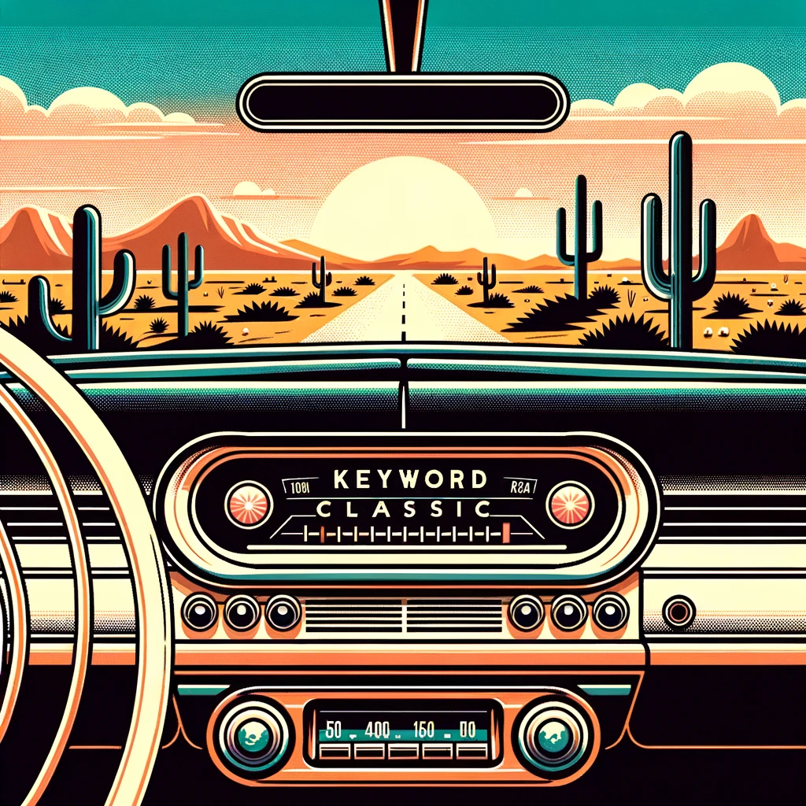

# Keyword Classic

Extracts keywords from a document using some classic NLP algorithms including Textrank, Cosine Similarity, Edit Distance, and TF-IDF.

## Usage

```sh
deno run -A src/kwd_classic.ts path/to/file.md
```

## Testing

```sh
deno test -A
```
